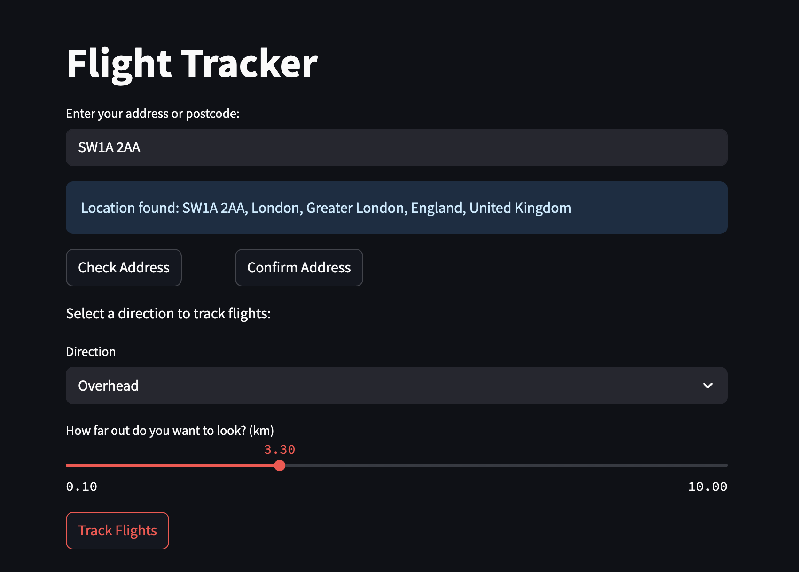
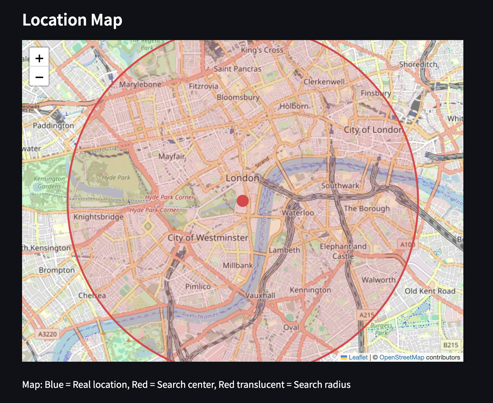
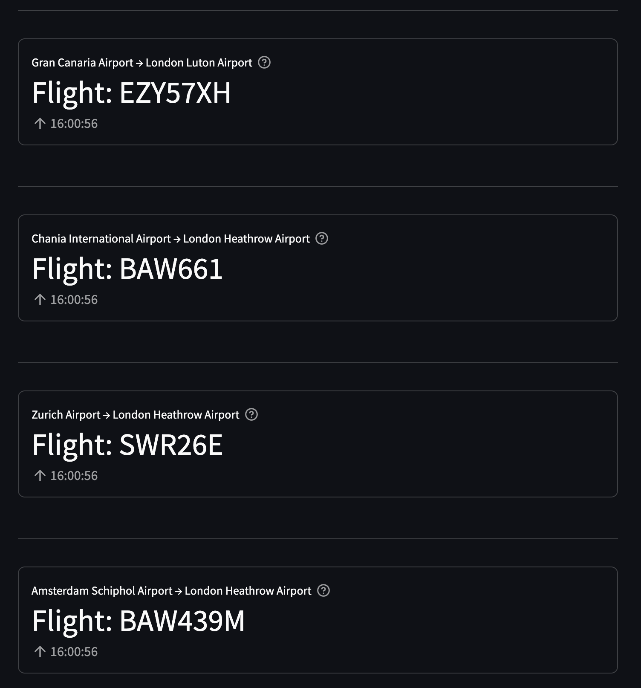

# Flight Tracker Application

This project is a flight tracking system that runs on Raspberry Pi with an e-ink display, and includes a web-based interface for development and remote monitoring.

## Project Components

### Raspberry Pi Flight Tracker (`raspi/`)

The core flight tracking system designed to run on Raspberry Pi with an e-ink display. Features:

- Real-time flight tracking using FlightRadar24 API
- E-ink display with boot sequence and flight information
- Voice feedback and logging
- Configurable search radius and location

### FastAPI Backend (`backend/`)

A web API that replicates the flight tracking functionality for web access:

- RESTful API endpoints for flight data
- WebSocket support for real-time updates
- Configuration management
- Boot sequence simulation

### React Frontend (`frontend/`)

A TypeScript React application that emulates the Raspberry Pi display:

- Accurate e-ink display simulation (250x122 pixels)
- Real-time flight tracking interface
- Settings page for configuration
- WebSocket integration for live updates

### Streamlit Proof of Concept (`streamlit_frontend/`)

Initial proof of concept interface (can be ignored for main development)

## Quick Start

### Development Environment

Use the provided startup script to run both backend and frontend:

```bash
./start-dev.sh
```

This will start:

- FastAPI backend on http://localhost:8000
- React frontend on http://localhost:5173

### Manual Setup

#### Backend

```bash
cd backend
pip install -r requirements.txt
python main.py
```

#### Frontend

```bash
cd frontend
npm install
npm run dev
```

#### Raspberry Pi

```bash
python raspi_main.py
```

# Flight Tracker Application

This project is a Streamlit application that allows users to track flights based on their selected direction. The application fetches flight data and displays relevant information about flights overhead in real-time.

## Project Structure

```
├── src
│   ├── app.py                # Main entry point of the Streamlit application
│   ├── components
│   │   └── __init__.py       # Reusable components for the Streamlit application
│   └── utils
│       └── __init__.py       # Utility functions for fetching and processing flight data
├── requirements.txt           # Project dependencies
└── README.md                  # Documentation for the project
```

## Setup Instructions

1. Clone the repository:

   ```
   git clone <repository-url>
   ```

2. Install the required dependencies:

   ```
   pip install -r requirements.txt
   ```

3. Run the Streamlit application:
   ```
   streamlit run src/app.py
   ```

## Usage Guidelines

- Upon running the application, users can select a direction (e.g., North, South, East, West) for flight tracking.
- The application will display flight information for flights currently overhead based on the selected direction.
- The information includes flight callsigns, origin and destination airports, and the current time of tracking.

## Application Screenshots

### 1. User Input Flow



_The user enters their address/postcode, checks and confirms the location, then selects direction and search radius._

### 2. Map Display



_The app displays the real location, search center, and search radius on an interactive map._

### 3. Flights Display



_Flight information is shown using metrics for each flight overhead, including callsign, route, and time._

## Contributing

Contributions are welcome! Please feel free to submit a pull request or open an issue for any enhancements or bug fixes.
