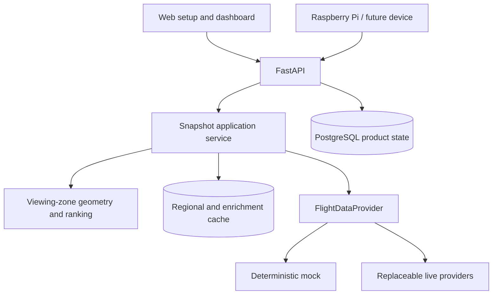

# Flight Tracker

Flight Tracker is an e-paper window display that identifies aircraft in the
part of the sky a person can actually see. A viewing zone combines the
observer's location, window direction, field of view, visible distance, and
optional altitude limits.

The repository is being migrated incrementally from a working FastAPI,
Vite/React, and Raspberry Pi prototype into a modular product architecture. The
prototype remains runnable while its new provider-neutral domain is built under
`apps/api`.

## Architecture


```mermaid
flowchart TD
    Web[Web setup and dashboard] --> API[FastAPI]
    Device[Raspberry Pi / future device] --> API
    API --> Snapshot[Snapshot application service]
    Snapshot --> Domain[Viewing-zone geometry and ranking]
    Snapshot --> Cache[(Regional and enrichment cache)]
    Snapshot --> Provider[FlightDataProvider]
    API --> Postgres[(PostgreSQL product state)]
    Provider --> Mock[Deterministic mock]
    Provider --> Live[Replaceable live providers]
```

The hardware consumes one small semantic `DisplaySnapshot`. It does not need to
understand provider SDKs, enrichment APIs, or global aircraft ranking.

## Repository structure

```text
apps/api/               New provider-neutral API core and tests
src/backend/            Runnable legacy FastAPI compatibility app
src/frontend/           Runnable legacy Vite/React app
src/raspi/              Runnable Raspberry Pi reference client
docs/architecture/      Current state, target state, and migration plan
docs/adr/               Architecture decisions
scripts/                Existing development and Pi launch scripts
```

The web and Pi applications will move into `apps/` only when their replacement
paths are implemented and tested.

## Local development

Python 3.12+, Node.js/npm, and Make are required. One command creates an
isolated environment, installs missing dependencies, and starts the API and web
application:

```bash
make dev
```

Open `http://localhost:5173`; setup starts at `http://localhost:5173/setup`.
Press Ctrl+C in the running terminal or use `make stop` from another terminal.

Useful project commands:

| Command | Purpose |
| --- | --- |
| `make setup` | Provision Raspberry Pi OS packages, SPI, display, runtimes, and web build |
| `make dev` | Install missing dependencies and run API + web |
| `make stop` | Gracefully stop a Makefile-managed stack |
| `make doctor` | Verify tools, processes, API, web, and web-to-API proxy |
| `make test` | Run domain, compatibility-backend, Pi simulator, and web build checks |
| `make lint` | Run Ruff, mypy, ESLint, and strict TypeScript checks |
| `make format` | Apply Python formatting and safe lint fixes |
| `make pi` | Run API + cached web build + e-paper client on Raspberry Pi |

The former startup shell scripts remain as compatibility shims and delegate to
these Make targets; they no longer manage environments or processes themselves.

## Mock-provider core

The provider-neutral core can also be tested directly:

```bash
cd apps/api
python3 -m unittest discover -s tests -v
```

The seeded mock provider includes moving aircraft, complete and partial
enrichment, empty sky, timeout, and rate-limit scenarios. It requires no paid
credentials, network access, Raspberry Pi, or display.

## Physical device

The Waveshare 2.13-inch V4 Raspberry Pi prototype remains supported during the
migration. Follow [RASPI_SETUP.md](RASPI_SETUP.md), then start the current full
Pi stack with:

```bash
make pi
```

On an unpaired device, the e-paper screen remains on a QR and short pairing code.
Scanning it opens the responsive setup flow on the phone; successful setup
clears the pairing state on the device's next poll.

## Documentation

- [Current-state audit](docs/architecture/current-state.md)
- [Target architecture](docs/architecture/target-state.md)
- [Incremental migration plan](docs/architecture/migration-plan.md)
- [Raspberry Pi setup](RASPI_SETUP.md)
- [Troubleshooting](docs/TROUBLESHOOTING.md)
- [MIT licence](LICENSE)
