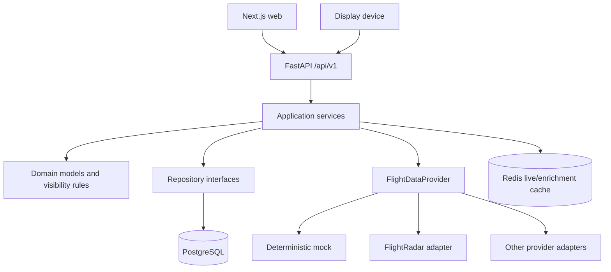
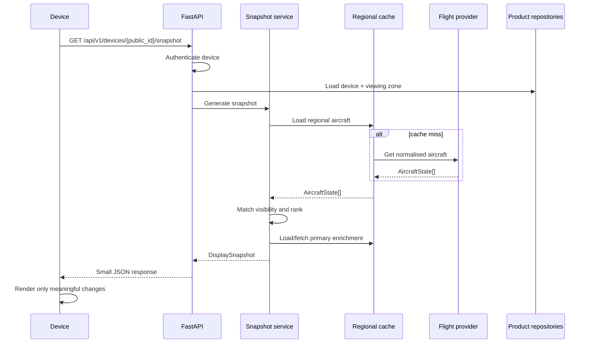
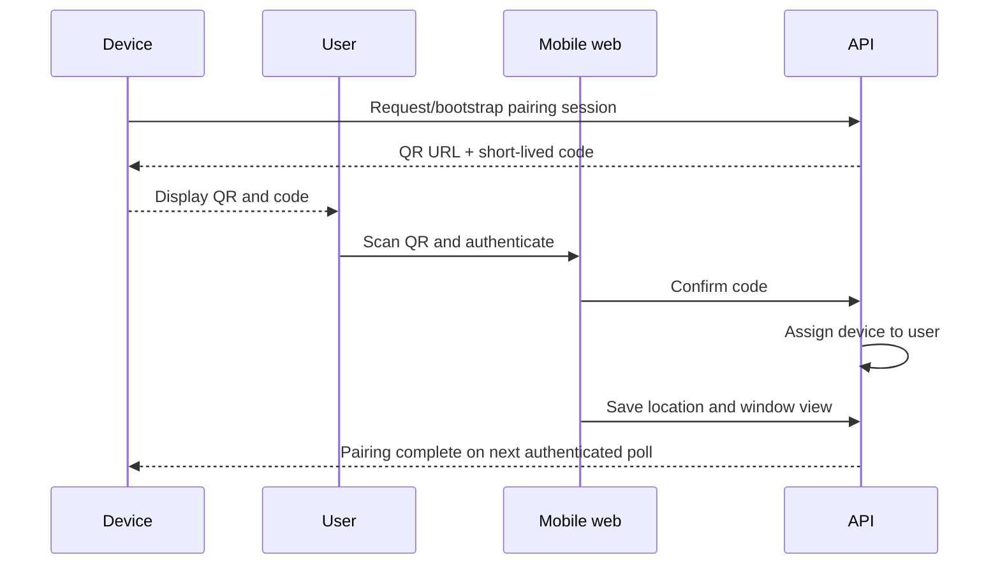
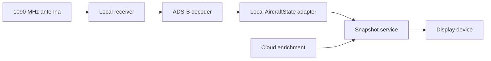

# Target State

## Product boundary

The product answers “what aircraft can I see through this window?” A
`ViewingZone`—observer location, bearing, field of view, visible distance, and
optional altitude limits—is therefore the centre of the domain. Radius-only
nearby-flight lists remain a diagnostic capability, not the customer contract.

The target is a modular monolith with three independently runnable clients:

```text
flight-tracker/
├── apps/
│   ├── api/          # FastAPI application and Python domain
│   ├── web/          # Next.js App Router customer application
│   └── device-pi/    # Raspberry Pi reference client
├── packages/
│   ├── contracts/    # Generated/validated TypeScript API contracts
│   ├── design-tokens/
│   └── display-contracts/
├── infra/
├── docs/
├── scripts/
└── tests/
```

Only `apps/api` is introduced in the first redevelopment slice. The legacy
applications remain under `src/` until callers can be migrated without losing
working behaviour.

## Runtime architecture



Domain code has no FastAPI, SQLAlchemy, Redis, FlightRadar, or hardware imports.
Routes validate transport data, enforce identity/ownership, call application
services, and translate known errors. Provider payloads are normalised inside
adapters.

## Core modules

### Domain

- `User` owns one or more `Device` records.
- `Device` has a non-sequential public ID and separately stored credentials.
- A V1 `Device` has one enabled `ViewingZone`.
- `AircraftState` represents short-lived normalised live position data.
- `FlightInformation` represents optional, longer-lived enrichment.
- `VisibleAircraft` records the explainable result of geometry and ranking.
- `DisplaySnapshot` is the small, stable device contract.

Missing provider fields remain `None`; presentation layers decide how to omit
them. Provider names and provider-specific IDs are provenance, not branching
conditions in domain services.

### Providers and caching

`FlightDataProvider` exposes capabilities plus asynchronous live-state and
enrichment methods. Each adapter owns authentication, timeouts, bounded retry,
rate-limit translation, parsing, and freshness semantics.

Live queries are keyed by a coarse geographic bucket and cached briefly.
Enrichment is cached separately with a longer policy. Device snapshot requests
reuse cached regional state; they do not automatically cause one paid upstream
request per device.

Redis is an adapter behind cache interfaces. The deterministic mock provider
works without Redis, credentials, or network access.

### Persistence

PostgreSQL and Alembic become the source of product state. Initial persistence
modules cover users, devices, device credentials, viewing zones, and detection
events. Exact coordinates are excluded from ordinary log and analytics fields.
TOML remains only for local bootstrap and device defaults.

### Identity

Browser sessions authenticate users through a proven provider behind an auth
boundary. A device authenticates with its public ID and a high-entropy,
revocable credential. Pairing codes are short-lived and are never device
credentials. Every product query enforces ownership or device identity.

## Snapshot flow



Provider failures produce explicit degraded snapshot states. Missing optional
enrichment does not discard valid live aircraft state.

## Pairing flow



## Web target

`apps/web` uses Next.js App Router, React, TypeScript, Tailwind, and Zod. Route
components compose feature modules; API transport and runtime validation live
outside components. Mobile web setup is the first client. The prominent flow
is pairing → location → window direction → sector preview → active display.

The design is restrained and e-paper-adjacent: high-contrast typography,
generous space, quiet status treatments, and a purposeful top-down viewing-cone
diagram. The same semantic snapshot drives the customer simulator and hardware
renderer.

## Device target

The Pi becomes a reference implementation of a simple HTTP/JSON device:

```text
authenticate → fetch DisplaySnapshot → compare semantic content → render →
wait refresh_after_seconds
```

It retains the last useful screen through transient failures, shows a subtle
stale/offline state when needed, applies bounded retry, and does not import a
flight provider. Hardware adapters own panel dimensions and refresh features;
renderers own layouts for those capabilities.

## Health and operations

- `/health/live` proves the process is running.
- `/health/ready` reports required dependency readiness.
- `/api/v1/system/provider-status` reports provider health separately.
- Structured logs include request/correlation ID, public device identifier,
  coarse region, latency, and stable error code—not exact home coordinates or
  secrets.
- Metrics distinguish provider errors, rate limits, cache hits/misses, device
  last-seen, and snapshot generation latency.

## Future local ADS-B path (not implemented)



The provider boundary permits this future input without changing viewing-zone
geometry or the display contract.

